# BrainSee-SCG

- [BrainSee-SCG](#brainsee-scg)
Our model is built upon our trained modular Hypercolumn-like features and ControlNet. The hypercolumn-like features are trained using a self-supervised method. Based on these features, we train several ControlNets. This approach utilizes a comprehensive modular feature set that is automatically learned and differentiated, resulting in robustness and generalization transfer capabilities. By configuring and combining appropriate control modules, it can effectively transfer to features without prior learning. We exclusively train them on the COCO dataset, yet they demonstrate the ability to dehaze and lighting. 

## Dehaze

### Prepare
Prepare data and write data information into './data/testdata.json'

### Run
python ./hyper2img_test.py --cur_config './models/cldm_v15_0_512.yaml' --cur_ckpt './controlNet_ckpt/ckp_0_512/epoch=10-step=325291.ckpt' --output_dir './output' --test_json_path './data/testdata.json' --hyper_scale

### result
#### haze image
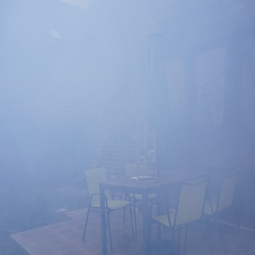
#### generated image
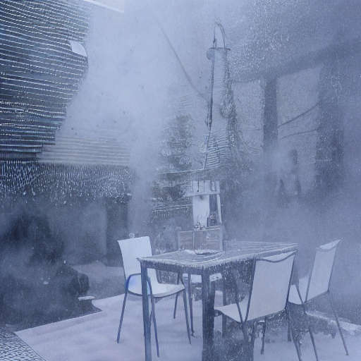

#### haze image
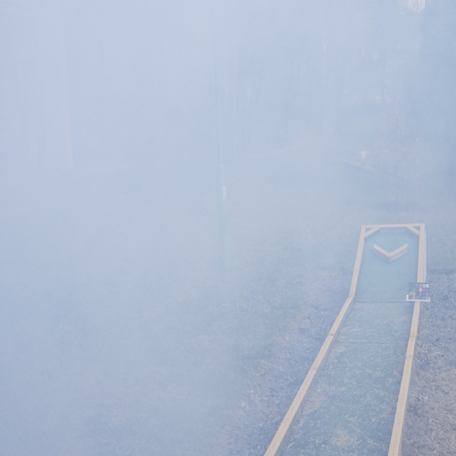
#### generated image
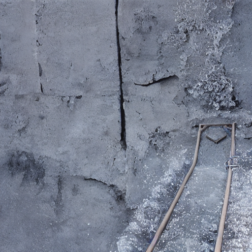

#### haze image
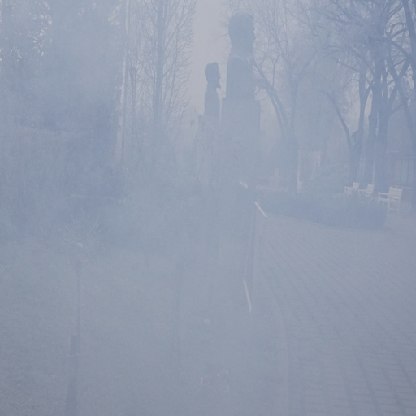
#### generated image
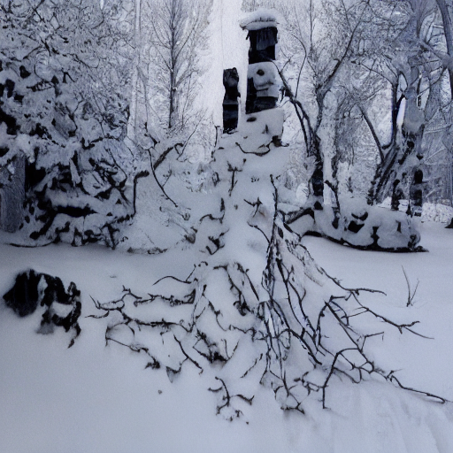

## Light

### Prepare
Prepare data and write data information into './data/low/testdata.json'

#### Run:
python ./hyper2img_test_try.py --cur_config './models/cldm_v15_0_512.yaml' --cur_ckpt './controlNet_ckpt/ckp_0_512/epoch=10-step=325291.ckpt' --output_dir './output' --test_json_path './data/low/testdata.json' --hyper_scale [1]

#### dark image
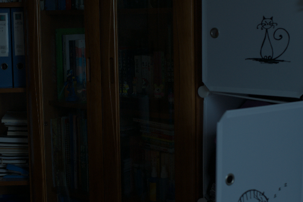
#### generated image
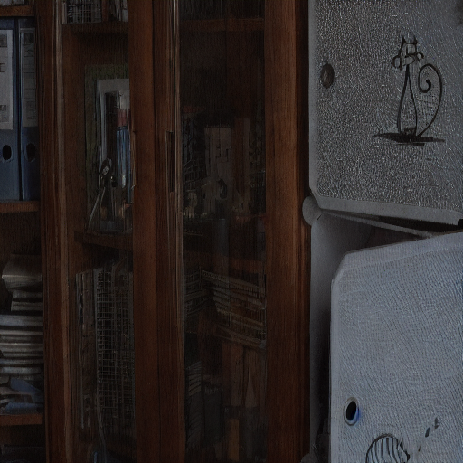

#### dark image
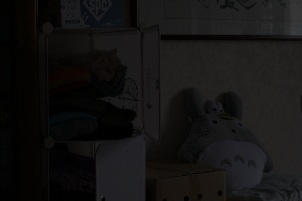
#### generated image
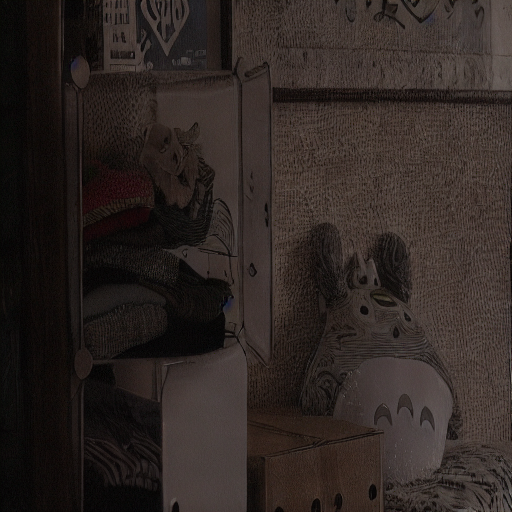

#### dark image
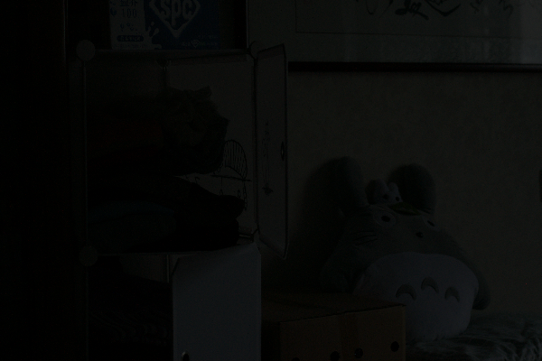
#### generated image
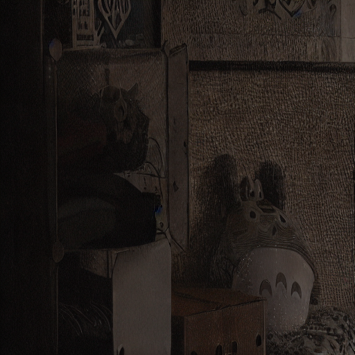